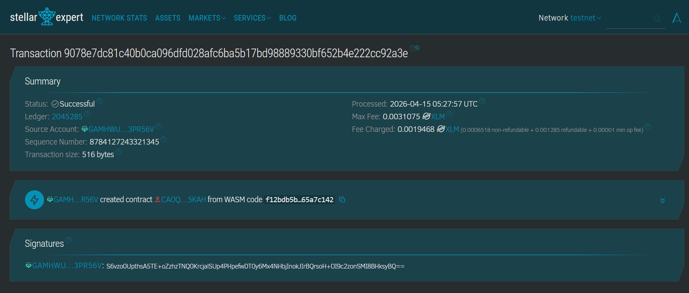

# 📚 Soroban Books Management System

Smart Contract berbasis Rust yang dideploy di jaringan **Stellar Soroban**. Kontrak ini memungkinkan manajemen data buku (CRUD) secara terdesentralisasi dengan penyimpanan data langsung di blockchain (on-chain).

---

## 🖼️ Tampilan Hasil Run
*(Pastikan file gambar sudah kamu upload ke folder project dengan nama 'screenshot.png')*

  
  

---

## 📝 Identitas Kontrak
| Properti | Detail |
| :--- | :--- |
| **Contract ID** | `CAOQIJITAXNJUEJ6SERB5M6FC35BTH5ATTJUZQPKT2AMWQGHB2VV5KAH` |
| **Source Account** | `salsabillanajwa` |
| **Network** | Testnet |
| **WASM Hash** | `f12bdb5bb97706d8d55c1c2cbf4ebf9b4c29600e4569f67c1f57b81a65a7c142` |

---

## ⚙️ Fitur & Fungsi
Kontrak ini menggunakan fitur `env.storage().instance()` untuk penyimpanan data permanen.

| Fungsi | Deskripsi | Parameter |
| :--- | :--- | :--- |
| `create_book` | Menambah buku baru | `title`, `category`, `isbn` |
| `get_books` | Mengambil semua buku | `id`  |
| `get_book_by_id` | Cari buku secara spesifik | `id` |
| `update_book` | Edit info buku | `id`, `new_title`, `new_category`, `new_isbn` |
| `delete_book` | Hapus buku dari storage | `id` |

---
